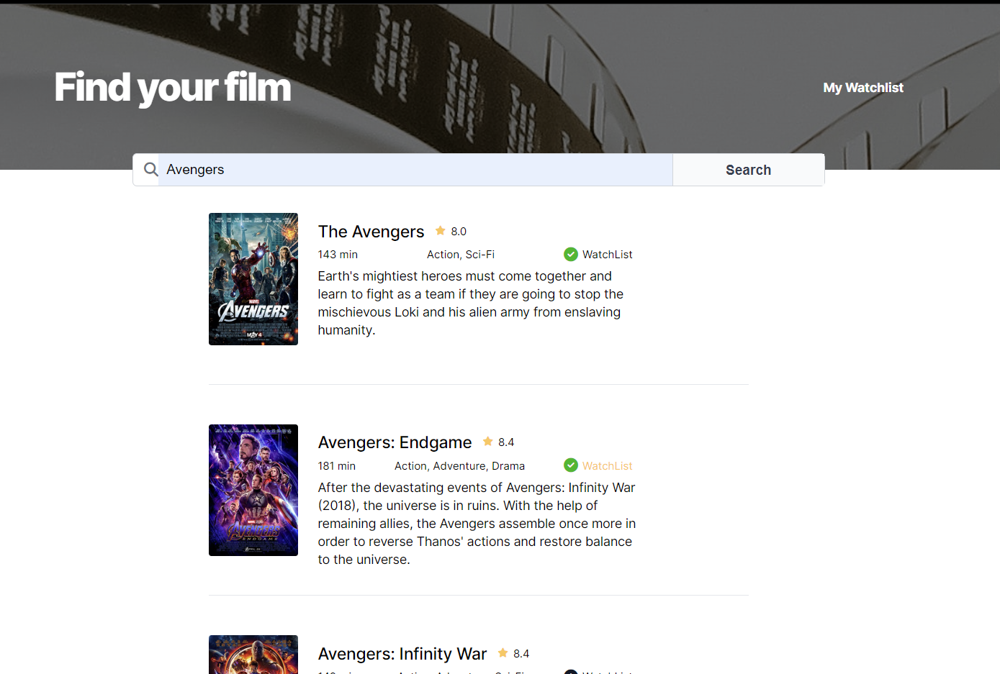

# Movie WatchList App

This is a Scrimba Challenge of a movie watchList App using the [OMDb movie database API](https://www.omdbapi.com/). 
The app takes a title input of a movie then returns the movies that match the search query. You have the ability to add the movies to a watchList page by storing the selecting movie in local storage then rendering it when the window is loaded. 

# Project Presentation

